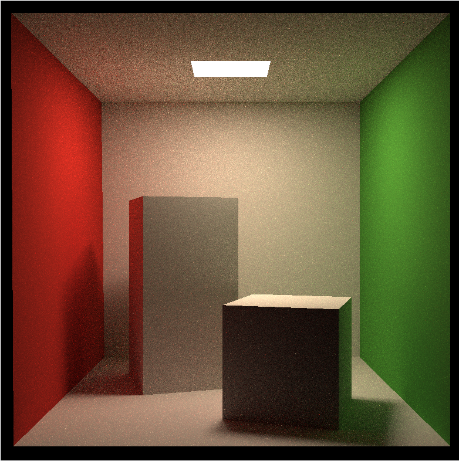

# CG_Assignment_3

## **完成情况**

- [x] **[70%]** **Path Tracing**：正确实现 Path Tracing 算法，并提交分辨率不小于512*512，采样数不小于 8 的渲染结果图片; 
- [x] **光线与三角形相交**：正确实现 Moller-Trumbore 算法
- [x] **[30%]** **BVH加速结构**： 正确实现光线与包围盒求交函数；正确实现BVH加速的光线与场景求交。


## 实验结果

`分辨率` 784*784 `SPP` 64 `运行时长` 3minutes 207seconds



## 存在问题及解决

### 一、运行时间长

1.构建开销过大

`global.hpp`下的`get_random_float()`随机数生成函数存在问题，它会导致在重复调用该函数时，返回同一个值

```c++
inline float get_random_float()
{
    std::random_device dev;
    std::mt19937 rng(dev());
    std::uniform_real_distribution<float> dist(0.f, 1.f); // distribution in range [1, 6]
    return dist(rng);
}
```

**解决方法**：把其中定义的`dev`，`rng`，`dist`变量定义为静态变量（加个**static**修饰）

```c++
static std::random_device dev;
static std::mt19937 rng(dev());
static std::uniform_real_distribution<float> dist(0.f, 1.f);
```

**结果** ：运行时间加快，SPP=10，12分钟——>4分钟

2.多线程

每个线程分别独立一定数量计算像素颜色，**原则上就是要最大化每个线程的计算量，对整个frame计算使用多线程。**具体使用C++里面的`thread`进行多线程

```c++
int process = 0;
    auto deal = [&](int lx, int rx, int ly, int ry) {
        for (uint32_t j = ly; j <= ry; ++j) {
            int m = j * scene.width + lx;
            for (uint32_t i = lx; i <= rx; ++i) {
                // generate primary ray direction
                float x = (2 * (i + 0.5) / (float)scene.width - 1) *
                    imageAspectRatio * scale;
                float y = (1 - 2 * (j + 0.5) / (float)scene.height) * scale;

                Vector3f dir = normalize(Vector3f(-x, y, 1));
                for (int k = 0; k < spp; k++) {
                    framebuffer[m] += scene.castRay(Ray(eye_pos, dir), 0) / spp;
                }
                m++;
                process++;
            }
            {
                std::lock_guard<std::mutex> g1(mutex_ins);
                UpdateProgress(1.0 * process / scene.width / scene.height);
            }
        }
    };
    int minx = 0, maxx = scene.width - 1;
    int miny = 0, maxy = scene.height - 1;

    const int bx = 5, by = 5;
    int nx = (scene.width + bx - 1) / bx, ny = (scene.height + by - 1) / by;
    std::thread th[bx * by];
    for (int i = 0, id = 0;i < scene.width;i += nx) {
        for (int j = 0;j < scene.height;j += ny) {
            th[id] = std::thread(deal, i, std::min(i + nx, scene.width) - 1,
                j, std::min(j + ny, scene.height) - 1);
            id++;
        }
    }

    for (int i = 0;i < bx * by;i++) th[i].join();

    UpdateProgress(1.f);
```

结果：SPP：64


### 二、渲染结果中光源区域为纯黑

伪代码中缺少了光线直接与光源相交的部分，应加上该部分

```c++
	// 直接光照
    Vector3f L_direct;
    {
        Intersection inter_dir;                 // 采样光源以计算直接光照
        float pdf_dir;
        sampleLight(inter_dir, pdf_dir);

        Vector3f& x = inter_dir.coords;
        Vector3f ws = normalize(x - p);
        Vector3f light_normal = normalize(inter_dir.normal);

        auto pws = intersect(Ray(p, ws));       // 检查从交点到采样的光源是否被遮挡
        if (pws.happened && (pws.coords - x).norm() < 1e-2) {
            // 使用BRDF和阴影项计算直接光照贡献
            L_direct = inter_dir.emit * material->eval(ws, wo, normal) * dotProduct(normal, ws)
                * dotProduct(light_normal, -ws) / (dotProduct((x - p), (x - p)) * pdf_dir);
            // 确保结果是非负的
            format(L_direct);
        }
    }
    // 间接光照
    Vector3f L_indirect;
    {
        // 使用俄罗斯轮盘赌来决定是否继续路径追踪
        float RR = this->RussianRoulette;
        if (get_random_float() < RR) {
            // 根据材质的BRDF采样新的方向（wi）
            Vector3f wi = normalize(material->sample(wo, normal));
            L_indirect = castRay(Ray(p, wi), depth + 1)            // 递归地追踪采样的方向（wi）的新光线
                * material->eval(wi, wo, normal) * dotProduct(wi, normal)
                / (material->pdf(wi, wo, normal) * RR);
            format(L_indirect);                 // 确保结果是非负的
        }
    }

    // 返回直接光照和间接光照贡献之和
    return L_direct + L_indirect;
```

## 具体实现

### 1.**Path Tracing** 算法

```c++
Vector3f Scene::castRay(const Ray& ray, int depth) const
{
    // TO DO Implement Path Tracing Algorithm here

    Intersection intersection = intersect(ray); // 寻找光线与场景的交点

    if (!intersection.happened)                 // 如果没有交点，返回黑色（对像素没有贡献）
        return Vector3f(0, 0, 0);

    if (intersection.emit.norm() > 0) {         // 如果交点处的材质发光，直接返回其发射的颜色
        if (depth == 0) {
            return intersection.emit;
        }
        else {
            return Vector3f(0, 0, 0);           // 否则，终止路径
        }
    }

    // 从交点提取相关信息

    Vector3f& p = intersection.coords;
    Vector3f wo = normalize(-ray.direction);    // 从交点射出的方向
    Vector3f normal = normalize(intersection.normal);
    Material*& material = intersection.m;

    auto format = [](Vector3f& a) {             // 辅助函数，确保向量没有负分量
        if (a.x < 0) a.x = 0;
        if (a.y < 0) a.y = 0;
        if (a.z < 0) a.z = 0;
    };
    // 直接光照
    Vector3f L_direct;
    {
        Intersection inter_dir;                 // 采样光源以计算直接光照
        float pdf_dir;
        sampleLight(inter_dir, pdf_dir);

        Vector3f& x = inter_dir.coords;
        Vector3f ws = normalize(x - p);
        Vector3f light_normal = normalize(inter_dir.normal);

        auto pws = intersect(Ray(p, ws));       // 检查从交点到采样的光源是否被遮挡
        if (pws.happened && (pws.coords - x).norm() < 1e-2) {
            // 使用BRDF和阴影项计算直接光照贡献
            L_direct = inter_dir.emit * material->eval(ws, wo, normal) * dotProduct(normal, ws)
                * dotProduct(light_normal, -ws) / (dotProduct((x - p), (x - p)) * pdf_dir);
            // 确保结果是非负的
            format(L_direct);
        }
    }
    // 间接光照
    Vector3f L_indirect;
    {
        // 使用俄罗斯轮盘赌来决定是否继续路径追踪
        float RR = this->RussianRoulette;
        if (get_random_float() < RR) {
            // 根据材质的BRDF采样新的方向（wi）
            Vector3f wi = normalize(material->sample(wo, normal));
            L_indirect = castRay(Ray(p, wi), depth + 1)            // 递归地追踪采样的方向（wi）的新光线
                * material->eval(wi, wo, normal) * dotProduct(wi, normal)
                / (material->pdf(wi, wo, normal) * RR);
            format(L_indirect);                 // 确保结果是非负的
        }
    }

    // 返回直接光照和间接光照贡献之和
    return L_direct + L_indirect;
}
```

### 2.**Moller-Trumbore **算法

```c++
inline Intersection Triangle::getIntersection(Ray ray)
{
    Intersection inter;

    if (dotProduct(ray.direction, normal) > 0)
        return inter;
    double u, v, t_tmp = 0;
    Vector3f pvec = crossProduct(ray.direction, e2);
    double det = dotProduct(e1, pvec);
    if (fabs(det) < EPSILON)
        return inter;

    double det_inv = 1. / det;
    Vector3f tvec = ray.origin - v0;
    u = dotProduct(tvec, pvec) * det_inv;
    if (u < 0 || u > 1)
        return inter;
    Vector3f qvec = crossProduct(tvec, e1);
    v = dotProduct(ray.direction, qvec) * det_inv;
    if (v < 0 || u + v > 1)
        return inter;
    t_tmp = dotProduct(e2, qvec) * det_inv;

    // TODO find ray triangle intersection
    double eps = 0;
    if (t_tmp > eps && u > eps && v > eps && 1 - u - v > eps) {
        inter.happened = true;
        // 交点坐标
        inter.coords = ray(t_tmp);
        // 设置交点法线
        inter.normal = normal;
        // 设置交点材质
        inter.m = this->m;
        // 设置交点所属的物体
        inter.obj = this;
        // 设置交点距离
        inter.distance = t_tmp;
        // 设置发光属性
        inter.emit = m->getEmission();
    }
    return inter;
}
```

### 3.**BVH加速结构**

`光线与包围盒求交函数`

```c++
inline bool Bounds3::IntersectP(const Ray& ray, const Vector3f& invDir,
                                const std::array<int, 3>& dirIsNeg) const
{
    // invDir: ray direction(x,y,z), invDir=(1.0/x,1.0/y,1.0/z), use this because Multiply is faster that Division
    // dirIsNeg: ray direction(x,y,z), dirIsNeg=[int(x>0),int(y>0),int(z>0)], use this to simplify your logic
    // TODO test if ray bound intersects
    // TODO 测试射线与边界的相交性
    auto t0 = (pMin - ray.origin) * invDir;
    auto t1 = (pMax - ray.origin) * invDir;

    auto v0 = Vector3f(std::min(t0.x, t1.x), std::min(t0.y, t1.y), std::min(t0.z, t1.z));
    auto v1 = Vector3f(std::max(t0.x, t1.x), std::max(t0.y, t1.y), std::max(t0.z, t1.z));

    // 计算射线与边界的进入和退出时间
    float tenter = std::max(v0.x, std::max(v0.y, v0.z));
    float texit = std::min(v1.x, std::min(v1.y, v1.z));

    // 检查是否存在相交并且退出时间大于0
    return tenter <= texit && texit > 0;
}
```

`BVH加速的光线与场景求交`

```c++
Intersection BVHAccel::getIntersection(BVHBuildNode* node, const Ray& ray) const
{
    // TODO Traverse the BVH to find intersection
    // 判断光线方向是否为负
    std::array<int, 3> dirIsNeg = { ray.direction.x > 0, ray.direction.y > 0, ray.direction.z > 0 };

    // 如果光线与节点包围盒不相交，返回空的Intersection
    if (!node->bounds.IntersectP(ray, ray.direction_inv, dirIsNeg)) {
        return Intersection();
    }
    else {
        // 如果节点有左右子节点
        if (node->left && node->right) {
            // 递归地查找左子树和右子树的交点
            auto L = getIntersection(node->left, ray);
            auto R = getIntersection(node->right, ray);

            // 返回距离更近的交点
            if (L.distance > R.distance)
                return R;
            return L;
        }
        else {
            // 如果节点是叶节点，则直接调用物体的getIntersection来查找交点
            return node->object->getIntersection(ray);
        }
    }
}
```
